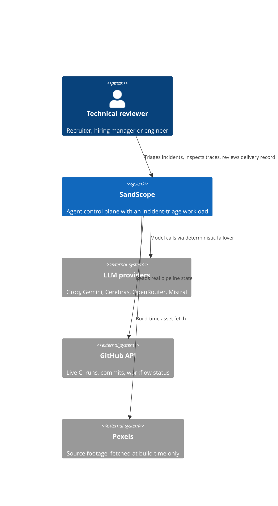
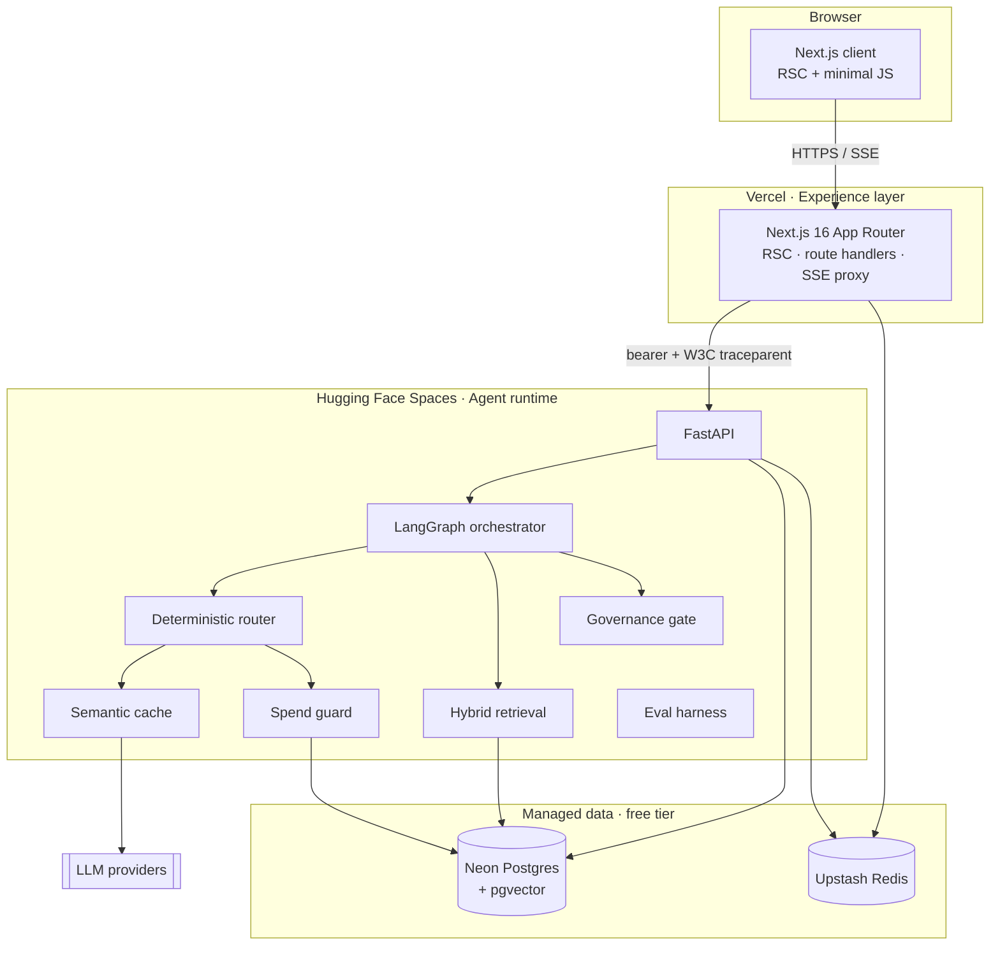
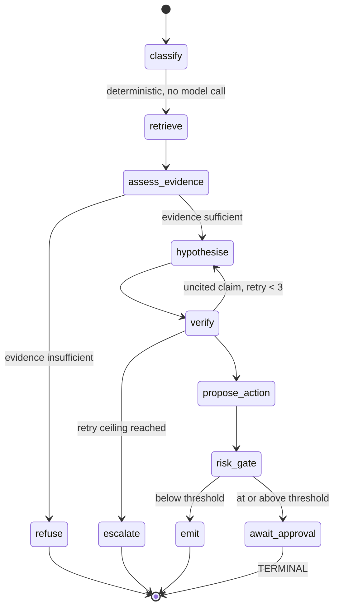
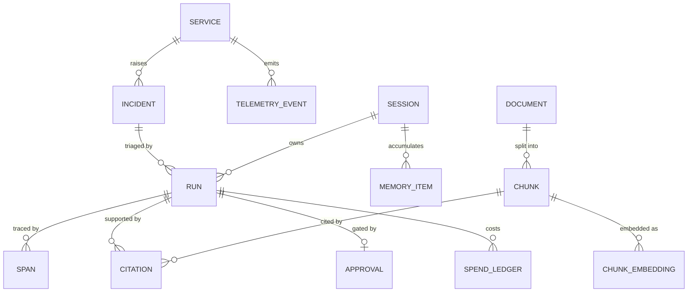

# Technical Specification

**Product:** SandScope *(name provisional — ADR-0002)*
**Version:** 1.0 · **Author:** Solutions Architect · **Date:** 2026-08-20
**Status:** DRAFT — awaiting sign-off
**Upstream:** [BRD.md](../01-requirements/BRD.md) · [PRD.md](../01-requirements/PRD.md)

---

## 1. System context



**Design consequence of the Pexels edge:** footage is fetched, transcoded and
committed **at build time**, never at request time. Scroll-scrubbing requires a
same-origin, correctly-encoded file with a seekable index; a hotlinked remote
video cannot be scrubbed reliably and adds a third-party dependency to first
paint (NFR-003).

## 2. Container architecture



### Why two runtimes (AC-001)

The split is not decorative. Python owns LangGraph, BM25, the local embedder and
the evaluation harness — all of which exist in Python and have no equivalent
worth reimplementing. Next.js owns React Server Components, edge streaming and
the motion layer. The boundary is a versioned HTTP contract, so either side can
be replaced without touching the other. That is the whole justification; if it
stopped being true, the correct move would be to collapse to one runtime.

## 3. Components

### 3.1 Deterministic router

Ordered provider failover. Providers are attempted in a fixed sequence; a
provider that rate-limits is disabled for a bounded TTL rather than permanently,
and a provider that reports billing or quota exhaustion is disabled for the
process lifetime.

| Property | Decision |
|---|---|
| Order | Groq → Gemini → Cerebras → OpenRouter → Mistral |
| Rate-limit response | Time-boxed disable, 600 s TTL, auto re-enable on expiry |
| Quota/billing exhaustion | Permanent disable for the process |
| Consecutive-429 ceiling | 8 before escalation to disable |
| Per-provider pacing | Configurable minimum gap between calls |
| Clock | Injected, never `time.time()` directly — otherwise TTL expiry is untestable |
| State | Explicit `RouterState` object, not module globals — otherwise tests leak into each other |
| Failure injection | `FailureInjector` interface backing FR-011 |
| `claude_cli` | Registered, `available=False` when `SandScope_ENV != local`. Surfaced honestly as `UNAVAILABLE — local only` (R-06) |

Derived from the router in `jobagent/utils/llm_router.py`, rewritten async and
made testable. The original's module-level mutable state and direct clock reads
are the two things that must not survive the port.

### 3.2 Semantic cache

Two tiers. An exact-hash tier keyed on the normalised prompt, model tier and
temperature. A semantic tier keyed on embedding proximity above a threshold.

**Correctness constraint:** cache vectors and query vectors must originate from
the same embedding model. Comparing a Gemini vector against a locally-computed
vector produces a number that looks like a similarity and means nothing. The
cache key therefore includes `embedding_model`; a lookup with a different active
model is a miss, not a cross-space comparison. See ADR-0005.

### 3.3 Hybrid retrieval

BM25 (lexical, pure Python, always available) fused with dense retrieval
(Gemini `text-embedding-004`, 768 dimensions). When the embedding provider is
unavailable, retrieval **degrades to lexical-only** and labels itself as
degraded, rather than falling back to a different embedding space.

### 3.4 Evidence assessment and refusal

The refusal decision is made on a signal that demonstrably separates answerable
from unanswerable questions.

This is the single most important lesson carried in from prior work: an earlier
harness gated refusal on a *fused ranking score* that read 0.031 on questions the
corpus answered and 0.031 on questions it could not. The check was structurally
incapable of refusing anything. Refusal here is gated on top-1 dense similarity
combined with lexical coverage of the question's content terms — signals that
move between the two classes — and the golden set exists to prove they do.

Thresholds are set so errors land on the safe side: nothing unanswerable is
answered, and some answerable questions are refused. Over-refusal costs a
follow-up question. The other direction costs the customer.

### 3.5 Orchestrator



**`await_approval` is terminal by construction.** It does not have an edge back
into the graph. A human decision starts a *new* run carrying the approval
record. This encodes a real defect found in prior work, where an approval node
flowed straight into registration and therefore registered the item regardless
of what the reviewer answered. A regression test asserts that no edge exists
from `await_approval` to any node (FR-007, BO-4).

`classify` makes no model call. If a typed rule can decide it, no token is spent
(Principle 3, NFR-001).

### 3.6 Governance gate and spend guard

The governance gate is a shared pre-execution check on every node that can call a
model or propose an action. The spend guard sits at the single model-call
chokepoint: a live call is refused unless a budget is open, each call is priced
at worst case *before* it fires, and actual cost is written to the ledger after
the response. This ordering matters — pricing after the fact is accounting, not
control.

## 4. Data model



| Table | Purpose | Notes |
|---|---|---|
| `service` | Simulated estate | Tier, owning team, dependency edges |
| `telemetry_event` | Metrics, logs, trace summaries | Seeded deterministically |
| `incident` | Triageable events | Severity, signature, status |
| `document` / `chunk` | Retrieval corpus: runbooks, postmortems, policies, architecture notes | |
| `chunk_embedding` | `(chunk_id, model, dim, vec)` — **unique on (chunk_id, model)** | Separates embedding spaces (ADR-0005) |
| `run` | One agent execution | Verdict, confidence, tokens, cost |
| `span` | OpenTelemetry spans | Written by a custom Postgres exporter |
| `citation` | Claim → chunk with score | Empty citation set on a claim is a defect |
| `approval` | Risk-gated decisions | Identity, timestamp, decision |
| `session` / `memory_item` | Session identity and memory | IP stored hashed, never raw |
| `cache_entry` | Semantic cache | Keyed with `embedding_model` |
| `provider_event` | Router health history | Powers the live provider panel |
| `spend_ledger` | Pre-flight estimate and actual cost per call | |
| `eval_run` | Golden-set results over time | Includes the deliberately-failing probe suite |

## 5. Service contract

`POST /v1/runs` — start a triage run. Returns `run_id`.
`GET  /v1/runs/{id}/stream` — SSE: `node_started`, `retrieval`, `token`, `citation`, `refusal`, `approval_required`, `node_completed`, `run_completed`, `error`.
`POST /v1/runs/{id}/approve` — record an approval decision; starts a continuation run.
`GET  /v1/runs/{id}/trace` — span tree.
`GET  /v1/providers` — live router health.
`GET  /v1/cache/stats` · `GET /v1/evals/latest` · `GET /v1/spend`
`POST /v1/chaos/provider` — inject a provider failure (FR-011). Rate-limited, session-scoped, never global.
`GET  /healthz` — liveness, used by the warm-ping.

Authentication between BFF and agent runtime is a shared bearer secret compared
in constant time. The browser never holds it.

## 6. Request lifecycle

```mermaid
sequenceDiagram
  participant B as Browser
  participant N as Next.js BFF
  participant R as Redis
  participant A as Agent runtime
  participant P as Postgres
  participant L as LLM provider

  B->>N: POST /api/runs
  N->>R: sliding-window rate check (IP hash)
  N->>A: POST /v1/runs (bearer + traceparent)
  A->>P: create run, open root span
  A->>P: hybrid retrieval
  A->>A: assess evidence
  alt evidence insufficient
    A-->>N: refusal event
  else sufficient
    A->>A: spend guard pre-flight price
    A->>L: model call (router order)
    L-->>A: completion
    A->>P: write spend ledger + spans
  end
  A-->>N: SSE event stream
  N-->>B: SSE (re-emitted; token never exposed)
```

The BFF creates the root span and forwards W3C `traceparent`, so a single trace
spans TypeScript and Python. Spans are exported to Postgres by a custom
exporter — real distributed tracing at zero vendor cost.

## 7. Failure modes

| # | Failure | Behaviour | Verified by |
|---|---|---|---|
| F-1 | Primary provider rate-limits | Time-boxed disable; next provider serves; visible in provider panel | Integration test, FR-011 |
| F-2 | All providers unavailable | Run fails closed with an explicit error; no fabricated output | Integration test |
| F-3 | Embedding provider unavailable | Retrieval degrades to BM25-only and labels itself degraded | Unit + integration |
| F-4 | Postgres unreachable | Read paths serve last-known cached state; write paths fail closed | Integration test |
| F-5 | Redis unreachable | Rate limiting fails **closed** (deny), not open | Unit test |
| F-6 | Agent runtime cold (post-sleep) | BFF returns a streaming placeholder; warm-ping keeps this rare | Manual + synthetic monitor |
| F-7 | Budget exhausted mid-run | Run halts at the guard; partial result marked incomplete, never presented as complete | Unit test |
| F-8 | Retry ceiling on uncited claims | Escalates rather than emitting uncited output | Unit test |

**F-5 deserves emphasis.** A rate limiter that fails open under Redis outage is
an unbounded-cost incident waiting for a Redis outage (NFR-004, R-04).

## 8. Non-functional design

| Requirement | Approach |
|---|---|
| NFR-002 zero cost | Vercel Hobby · HF Spaces free CPU · Neon free · Upstash free · free LLM tiers only |
| NFR-003 FMP < 2.5 s | RSC-first, minimal client JS, self-hosted encoded video, no render-blocking third parties |
| NFR-004 abuse resistance | Per-IP sliding window, daily token ceiling, spend guard, chaos endpoint session-scoped |
| NFR-005 ephemeral disk | No local state; corpus, index and traces all in Postgres |
| DR-001 visual standard | Scroll-scrubbed video, sticky pinning, IntersectionObserver, CSS scroll-driven animation |

## 9. Deployment

| Component | Target | Mechanism |
|---|---|---|
| Experience layer | Vercel | Git push to `main` |
| Agent runtime | HF Spaces (Docker SDK) | Git push to Space remote; `app_port: 7860` |
| Database | Neon | Migrations run in CI |
| Cache/limits | Upstash | Provisioned once |
| Warm-ping | Vercel Cron | 6-hourly `GET /healthz` |

Docker is unavailable on the build host (IMP-01). The runtime is therefore
developed against `uvicorn` natively, the Dockerfile is minimal and fully
pinned, and the HF build serves as the container integration test. This is a
real limitation and is recorded rather than papered over.

## 10. Observability

OpenTelemetry in both runtimes. Spans exported to Postgres and rendered in the
trace viewer. Structured JSON logs. Application metrics — provider health, cache
hit rate, refusal rate, cost per run, eval scores — are first-class product
surfaces rather than operator-only dashboards, because BO-1 through BO-5 are
about making exactly these visible.

## 11. Technology decisions

| Area | Choice | Rejected | Why |
|---|---|---|---|
| Experience | Next.js 16 App Router | Astro, plain HTML | RSC + streaming + one deploy target; Apple's technique is framework-independent anyway |
| Agent runtime | FastAPI + LangGraph | Node + LangChain.js | Graph primitives and the eval harness already exist in Python |
| Database | Neon Postgres + pgvector | Dedicated vector DB | One store for relational and vector data; free tier; no second system to reason about |
| Embeddings | Gemini `text-embedding-004` + zero-dependency local fallback | sentence-transformers | `torch` is 2–3 GB and would break HF build times and NFR-002 |
| Cache/limits | Upstash Redis | In-process | Ephemeral disk (NFR-005); must survive restarts |
| Tracing | OpenTelemetry → Postgres exporter | Hosted APM | Free, and the trace becomes a product surface rather than an ops tool |
| Motion | Native scroll-driven video + sticky | Animation library | Matches the reference standard; keeps the JS budget for NFR-003 |
